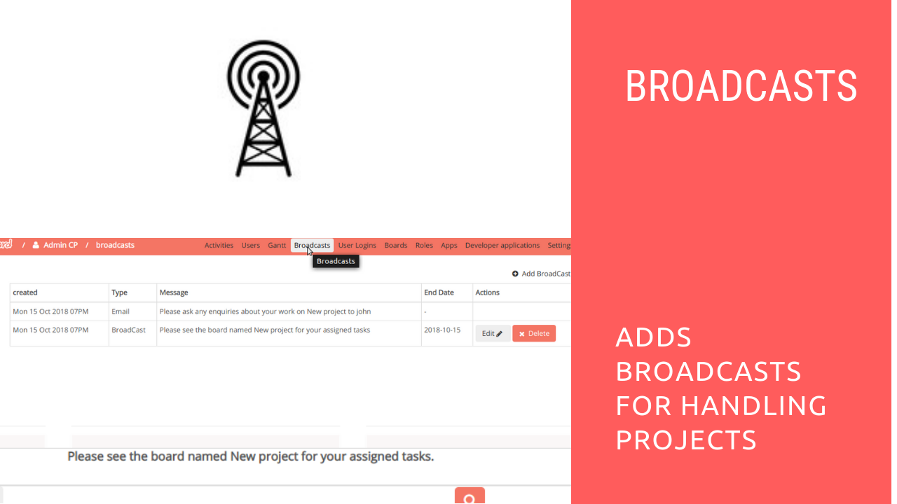

# Broadcasts Plugin Installation

## Broadcasts Plugin Installation

1.  Goto your Restyaboard installation root directory. e.g., directory: "/usr/share/nginx/html/restyaboard/"
2.  Extract/unzip the purchased plugin zip into the restyaboard installation path. e.g., "/usr/share/nginx/html/restyaboard/"
3.  Give file permission to extracted files. e.g., "chmod -R 0777 client/apps/r_broadcasts/"
4.  Execute the sql file in "client/apps/r_broadcasts/sql/r_broadcasts.sql" using the command "psql -h localhost -d {DATABASE_NAME} -U {USER_Name} -w < /usr/share/nginx/html/restyaboard/client/apps/r_broadcasts/sql/r_broadcasts.sql"
5.  After above process, clear the browser cache and login again to view the installed plugins on your Restyaboard.

## Creation of broadcasts

1.  For creating broadcasts, goto "http://{YOUR\_SERVER\_NAME}/#/apps/r_broadcast/broadcast?page=1" path in your Restyaboard server and click "Add Broadcast" and fill the details of broadcasts in the form and click the "add" button for submitting the broadcast. 
2.  Now, the broadcasts will be created. if the broadcast type is "Email", then it will send the broadcast message to all the users of the Restyaboard and if the broadcast type is "Broadcast", then it will show the broadcat message above the footer content for all logged in users.