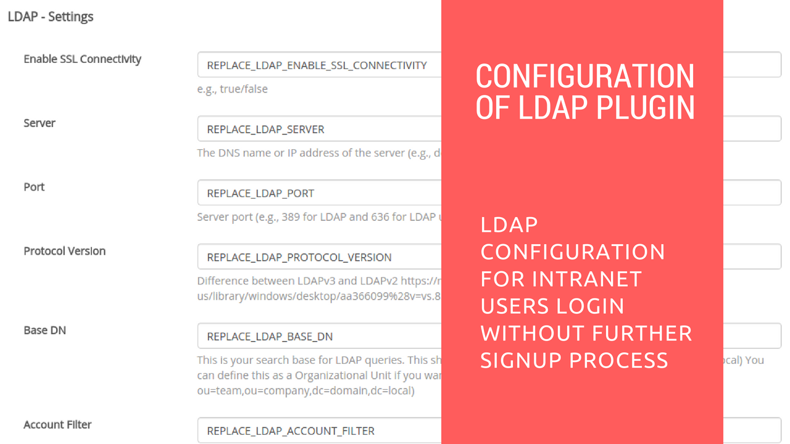

# LDAP

## Server Details

**Server**

* The DNS name or IP address of the server (e.g., dc.domain.local)

**Port**

* Server port (e.g., 389 for LDAP and 636 for LDAP using SSL)

**Protocol Version**

* 3 (Difference betwen LDAPv3 and LDAPv2 https://msdn.microsoft.com/en-us/library/windows/desktop/aa366099%28v=vs.85%29.aspx)

**Base DN**
* This is your search base for LDAP queries. 
* This should be at least your domain root, (e.g., dc=domain,dc=local) You can define this as a Organizational Unit if you want to narrow down the search base (e.g., ou=team,ou=company,dc=domain,dc=local)

## Connection details

**Account Filter**

* You can use different field from the username here. For pre-windows 2000 style login, use sAMAccountName and for a UPN style login use userPrincipalName.

**Advanced Filter**

* Enter a valid advanced filter like "(objectClass=user)(memberOf=CN=foo,OU=groups,dc=bar,dc=baz)", to filter user, groups and etc...

**Bind DN**

* Enter a valid user account/DN to pre-bind with if your LDAP server does not allow anonymous profile searches, or requires a user with specific privileges to search.

**Bind Password**   
* Enter a password for the above Bind DN.